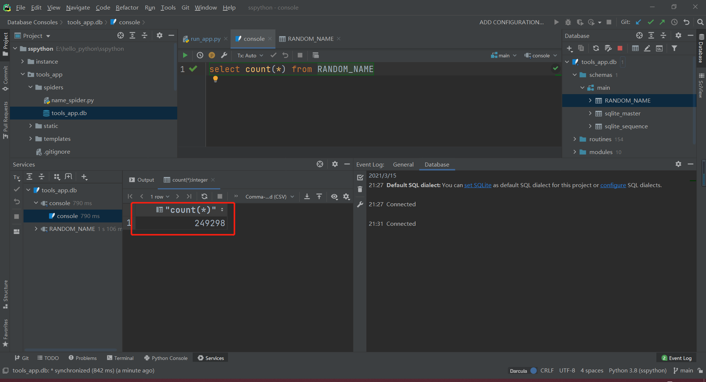

# 随机生成姓名

## 项目介绍

**为什么会有这么”奇葩“的项目呢？**

这个想法的出现来源于，我之前想过要写一篇小说，但是苦于思考创造人名这一步，所以就在想能不能有一个网站，我只需要输入姓氏，就能得到一些人名？所以就有了这个项目。

**哪里来的数据呢？**

这个问题，其实也不难解决，百度搜一会就有答案啦。于是我找到了[姓名大全](http://www.resgain.net/xmdq.html)这个网站，右击给这个网站做了一个“检查”，发现这个网站的构造挺简单的，不需要太高深的爬虫技巧就可以获取到数据。再把数据存到sqlite3数据库中，作为这个项目的源数据。

**这个项目会很复杂吗？**

> 越学越简单，越简单越难。

任何项目都可以很复杂的，所以以我的能力，尽可能的去实现较“复杂”的操作。

其实，乍一看，这个项目不复杂：

1. 爬虫获取数据，并保存到数据库。
2. 后端从数据获取数据，发送到前端。
3. 前端一个搜索框，根据输入的姓氏，从后端得到姓名并展示。

我在这个项目中主要用到的是这些技术：requests，flask，vue。有些知识我也不是很懂，都是直接一边学一边用，我觉得学以致用，更能感受到学习的乐趣。

## 爬虫详解

### 网站分析

需要从[姓名大全](http://www.resgain.net/xmdq.html)这个网站获取的数据有：

1. 百家姓列表：['赵','钱','孙','李',......]
2. 每个姓对应的男生名、女生名

**获取一个百家姓列表，主要是为了判断前端输入的姓氏是否正确。**

一、在谷歌浏览器中，右击“检查”，通过一番分析后，找到一个a标签，如下形式，可以通过这个标签，获取到该姓氏的具体的超链接（通过href获取），以及百家姓列表（通过文本拆分获取）。

```html
<a class="btn btn2" href="//zhao.resgain.net/name_list.html" title="赵姓名字大全共有赵姓名字162998个">赵姓名字大全</a>
```

二、继续分析，点击超链接进入到姓氏的详情页，发现每个姓氏都有男生和女生的超链接，如下：

```python
# 男生网站为：http://zhao.resgain.net/name/boys.html
# 女生网站为：http://zhao.resgain.net/name/girls.html
```

与之前分析的a标签中的href中的超链接有所不同，所以需要将**/name_list.html**替换为**/name/boys.html**和**/name/girls.html**才能得到对应姓氏的男生、女生姓名地址。

三、进入男生姓名网站中，每个姓名的html代码如下：

```html
<a href="#" class="livemsg" data-name="赵竹林"><span class="glyphicon glyphicon-comment"></span></a>			  		
```

通过class="livemsg"定位到该a标签，然后获取到data-name的属性值即可得到姓名。

### 数据库设计

这里选择sqlite3为数据库，主要是因为不需要复杂的配置，操作简单，轻便小巧。

这里只需要存姓名（NAME）、性别（SEX）两个字段即可，当然，再加一个自增的ID字段。

数据库设计代码如下：

```python
def create_db():
    conn = sqlite3.connect(r"tools_app.db")
    cursor = conn.cursor()
    cursor.execute('''CREATE TABLE RANDOM_NAME
           (ID INTEGER PRIMARY KEY  AUTOINCREMENT,
           NAME           TEXT    NOT NULL,
           SEX         TEXT    NOT NULL);''')
    print("RANDOM_NAME created successfully")
    conn.commit()
    conn.close()
```

> 代码解释：
>
> 1、conn是一个sqlite3数据库对象，只需传入database参数，这里传的tools_app.db表示，连接的是同级目录下的名为tools_app.db的数据库（数据库不需要提前创建）
>
> 2、cursor为操作数据库的“游标”，可以把数据库比喻成一个仓库，游标就像是一个优秀的员工，cursor.execute()就是这个员工需要对这个仓库做的事情；conn.commit()就是员工操作完后，仓库将操作的结果告诉员工。conn.close()仓库关门，期待下一次的开启。

这个函数运行完之后，会在同级目录下创建一个名为tools_app.db的数据库，该数据库中有一个名为RANDON_NAME的表。

### 爬虫设计

通过之前的**网站分析**，爬虫的运行应该分为以下三步：

1. 通过http://www.resgain.net/xmdq.html地址获取到每个姓氏href和文本信息。
2. 通过第一步获取的href，获取男生和女生的网站。
3. 通过第二步获取的网站获取对应的姓名。

第一步，代码详解：

```python
def get_name_link():
    url = "http://www.resgain.net/xmdq.html"
    res = requests.get(url)
    soup = BeautifulSoup(res.text, 'lxml')
    name_links = []
    for s in soup.find_all(attrs={'class': 'btn btn2'}):
        name_links.append("http:" + s.get('href'))
    return name_links
```

> 代码解释：
>
> 1、通过request.get()方法，传入url就可以获取到对应的网页对象，使用res.text属性获取到网页源码
>
> 2、使用BeautifulSoup格式化网页，可以很方便，很快速的定位到需要的数据。
>
> 3、soup.find_all(attrs={'class': 'btn btn2'})，通过class属性为btn btn2找到所有符合条件的元素，返回的是一个列表
>
> 4、通过s.get('href')方法可以获取到标签元素的href属性的值

同理，可以获取到百家姓列表：

```python
def get_name_list():
    url = "http://www.resgain.net/xmdq.html"
    res = requests.get(url)
    soup = BeautifulSoup(res.text, 'lxml')
    name_list = []
    for s in soup.find_all(attrs={'class': 'btn btn2'}):
        name_list.append(s.text.split("姓")[0])
    return name_list
```

> 1、s.text可以获取该标签中的文本内容
>
> 2、split("姓")方法，按照"姓"分隔字符串，结果为一个列表，选择第一个即为百家姓的姓氏。例如："赵姓名字大全"分隔后变成：["赵","姓名字大全"]

第二步，构造男生和女生的详情链接：

```python
name_link_list = get_name_link()
for name_link in name_link_list:
    url_boys = name_link.replace("/name_list.html", "/name/boys.html")
    url_girls = name_link.replace("/name_list.html", "/name/girls.html")
```

> 1、字符串替换用replace(需要替换的内容,替换的内容)

第三步，通过构造的链接获取姓名：

```python
def get_data(url):
    con = sqlite3.connect(r'tools_app.db')
    cursor = con.cursor()
    res = requests.get(url)
    soup = BeautifulSoup(res.text, 'lxml')
    if "boy" in url:
        sex_ = "男"
    else:
        sex_ = "女"
    for s in soup.find_all(attrs={'class': 'btn btn-default btn-lg namelist'}):
        name = s.find(attrs={'class': 'livemsg'}).get('data-name')
        sql = "insert into RANDOM_NAME (name,sex) values('{0}','{1}');".format(name,sex_)
        cursor.execute(sql)
        con.commit()
    print(url, "完成")
    con.close()
```

> 1、同样连接tools_app.db数据库，创建一个cursor对象，用来操作数据库
>
> 2、同样，使用soup.find_all()获取到所有的标签，通过get方法获取到姓名数据
>
> 3、构造sql语句，用format()方法格式化字符串
>
> 4、cursor.execute()执行sql插入语句，conn.commit()提交记录，最后for循环结束后，conn.close()关闭连接

开始运行：

```python
if __name__ == '__main__':
    # 创建数据库和RANDOM_NAME表
    # print(get_name_list())
    # create_db()
    # get_data('http://zhang.resgain.net/name/boys.html')
    name_link_list = get_name_link()
    for name_link in name_link_list:
        url_boys = name_link.replace("/name_list.html", "/name/boys.html")
        url_girls = name_link.replace("/name_list.html", "/name/girls.html")
        get_data(url_boys)
        t = random.randint(1, 3)
        time.sleep(t)
        get_data(url_girls)
        t = random.randint(1, 3)
        time.sleep(t)
```

爬虫获取数据总计耗时2小时左右，获取到数据249298条。



## 后端


## 前端设计

