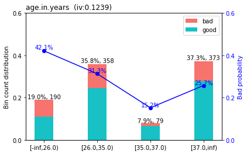
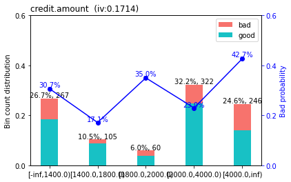
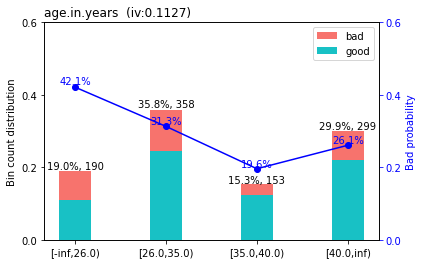
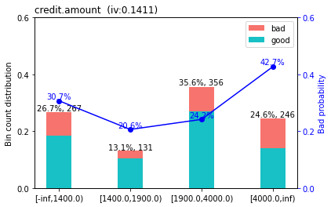
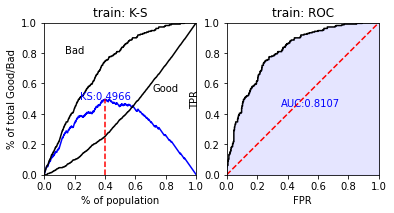
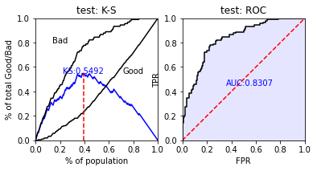
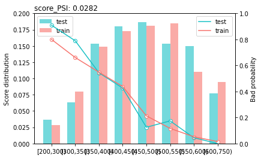

评分卡模型

- scorecardpy库  

github地址：https://github.com/ShichenXie/scorecardpy  

## 数据预处理


```python
import scorecardpy as sc
import pandas as pd
import numpy as np
```

### scorecardpy自带数据


```python
dat = sc.germancredit()
```

### 查看数据行列


```python
dat.shape
(1000, 21)
```

数据是由1000行，21列数据组成

### 查看数据内容,用sample()比head()可以看更多的数据


```python
dat.sample(5)
```

<table border="1" class="dataframe">
  <thead>
    <tr style="text-align: right;">
      <th></th>
      <th>status.of.existing.checking.account</th>
      <th>duration.in.month</th>
      <th>credit.history</th>
      <th>purpose</th>
      <th>credit.amount</th>
      <th>savings.account.and.bonds</th>
      <th>present.employment.since</th>
      <th>installment.rate.in.percentage.of.disposable.income</th>
      <th>personal.status.and.sex</th>
      <th>other.debtors.or.guarantors</th>
      <th>...</th>
      <th>property</th>
      <th>age.in.years</th>
      <th>other.installment.plans</th>
      <th>housing</th>
      <th>number.of.existing.credits.at.this.bank</th>
      <th>job</th>
      <th>number.of.people.being.liable.to.provide.maintenance.for</th>
      <th>telephone</th>
      <th>foreign.worker</th>
      <th>creditability</th>
    </tr>
  </thead>
  <tbody>
    <tr>
      <th>547</th>
      <td>no checking account</td>
      <td>24</td>
      <td>existing credits paid back duly till now</td>
      <td>radio/television</td>
      <td>1552</td>
      <td>... &lt; 100 DM</td>
      <td>4 &lt;= ... &lt; 7 years</td>
      <td>3</td>
      <td>male : single</td>
      <td>none</td>
      <td>...</td>
      <td>car or other, not in attribute Savings account...</td>
      <td>32</td>
      <td>bank</td>
      <td>own</td>
      <td>1</td>
      <td>skilled employee / official</td>
      <td>2</td>
      <td>none</td>
      <td>yes</td>
      <td>good</td>
    </tr>
    <tr>
      <th>617</th>
      <td>... &lt; 0 DM</td>
      <td>6</td>
      <td>critical account/ other credits existing (not ...</td>
      <td>car (new)</td>
      <td>3676</td>
      <td>... &lt; 100 DM</td>
      <td>1 &lt;= ... &lt; 4 years</td>
      <td>1</td>
      <td>male : single</td>
      <td>none</td>
      <td>...</td>
      <td>real estate</td>
      <td>37</td>
      <td>none</td>
      <td>rent</td>
      <td>3</td>
      <td>skilled employee / official</td>
      <td>2</td>
      <td>none</td>
      <td>yes</td>
      <td>good</td>
    </tr>
    <tr>
      <th>186</th>
      <td>0 &lt;= ... &lt; 200 DM</td>
      <td>9</td>
      <td>all credits at this bank paid back duly</td>
      <td>car (used)</td>
      <td>5129</td>
      <td>... &lt; 100 DM</td>
      <td>... &gt;= 7 years</td>
      <td>2</td>
      <td>female : divorced/separated/married</td>
      <td>none</td>
      <td>...</td>
      <td>unknown / no property</td>
      <td>74</td>
      <td>bank</td>
      <td>for free</td>
      <td>1</td>
      <td>management/ self-employed/ highly qualified em...</td>
      <td>2</td>
      <td>yes, registered under the customers name</td>
      <td>yes</td>
      <td>bad</td>
    </tr>
    <tr>
      <th>776</th>
      <td>no checking account</td>
      <td>36</td>
      <td>critical account/ other credits existing (not ...</td>
      <td>car (new)</td>
      <td>3535</td>
      <td>... &lt; 100 DM</td>
      <td>4 &lt;= ... &lt; 7 years</td>
      <td>4</td>
      <td>male : single</td>
      <td>none</td>
      <td>...</td>
      <td>car or other, not in attribute Savings account...</td>
      <td>37</td>
      <td>none</td>
      <td>own</td>
      <td>2</td>
      <td>skilled employee / official</td>
      <td>1</td>
      <td>yes, registered under the customers name</td>
      <td>yes</td>
      <td>good</td>
    </tr>
    <tr>
      <th>243</th>
      <td>no checking account</td>
      <td>12</td>
      <td>critical account/ other credits existing (not ...</td>
      <td>business</td>
      <td>1185</td>
      <td>... &lt; 100 DM</td>
      <td>1 &lt;= ... &lt; 4 years</td>
      <td>3</td>
      <td>female : divorced/separated/married</td>
      <td>none</td>
      <td>...</td>
      <td>real estate</td>
      <td>27</td>
      <td>none</td>
      <td>own</td>
      <td>2</td>
      <td>skilled employee / official</td>
      <td>1</td>
      <td>none</td>
      <td>yes</td>
      <td>good</td>
    </tr>
  </tbody>
</table>
<p>5 rows × 21 columns</p>
可以发现有none出现，代表的是缺失，可以用np.nan替换，方便统计每一个变量的缺失占比情况


```python
dat = dat.replace('none',np.nan)
```

### 统计每个变量的缺失占比情况


```python
(dat.isnull().sum()/dat.shape[0]).map(lambda x:"{:.2%}".format(x))
```


    status.of.existing.checking.account                          0.00%
    duration.in.month                                            0.00%
    credit.history                                               0.00%
    purpose                                                      0.00%
    credit.amount                                                0.00%
    savings.account.and.bonds                                    0.00%
    present.employment.since                                     0.00%
    installment.rate.in.percentage.of.disposable.income          0.00%
    personal.status.and.sex                                      0.00%
    other.debtors.or.guarantors                                 90.70%
    present.residence.since                                      0.00%
    property                                                     0.00%
    age.in.years                                                 0.00%
    other.installment.plans                                     81.40%
    housing                                                      0.00%
    number.of.existing.credits.at.this.bank                      0.00%
    job                                                          0.00%
    number.of.people.being.liable.to.provide.maintenance.for     0.00%
    telephone                                                   59.60%
    foreign.worker                                               0.00%
    creditability                                                0.00%
    dtype: object

other.debtors.or.guarantors（担保人）这一列数据的缺失占比超过90%，可以删除。

other.installment.plans（分期付款计划）这一列缺失占比也较高，只有两个分类，也可以删除。


```python
dat["other.installment.plans"].value_counts()
```


    bank      139
    stores     47
    Name: other.installment.plans, dtype: int64

telephone（电话）对建模没有太大意义，就像姓名，对建模没有太大影响。**但是电话是否填写**应该被考虑进去，这里先不讨论。


```python
dat = dat.drop(columns=["other.debtors.or.guarantors","other.installment.plans","telephone"])
```

### 查看数据的信息


```python
dat.info()
```

    <class 'pandas.core.frame.DataFrame'>
    RangeIndex: 1000 entries, 0 to 999
    Data columns (total 18 columns):
     #   Column                                                    Non-Null Count  Dtype   
    ---  ------                                                    --------------  -----   
     0   status.of.existing.checking.account                       1000 non-null   category
     1   duration.in.month                                         1000 non-null   int64   
     2   credit.history                                            1000 non-null   category
     3   purpose                                                   1000 non-null   object  
     4   credit.amount                                             1000 non-null   int64   
     5   savings.account.and.bonds                                 1000 non-null   category
     6   present.employment.since                                  1000 non-null   category
     7   installment.rate.in.percentage.of.disposable.income       1000 non-null   int64   
     8   personal.status.and.sex                                   1000 non-null   category
     9   present.residence.since                                   1000 non-null   int64   
     10  property                                                  1000 non-null   category
     11  age.in.years                                              1000 non-null   int64   
     12  housing                                                   1000 non-null   category
     13  number.of.existing.credits.at.this.bank                   1000 non-null   int64   
     14  job                                                       1000 non-null   category
     15  number.of.people.being.liable.to.provide.maintenance.for  1000 non-null   int64   
     16  foreign.worker                                            1000 non-null   category
     17  creditability                                             1000 non-null   object  
    dtypes: category(9), int64(7), object(2)
    memory usage: 80.8+ KB


可以看出数据是由int64，category，object类型的数据组成，**category类型的数据在pandas中很特殊，建议转为object类型数据。**

### 查看每个变量有多少分类


```python
# 顺便把category类型的数据转为object
for c in dat.columns:
    if str(dat[c].dtype) == "category":
        dat[c] = dat[c].astype(str)
    print(c,"：",len(dat[c].unique()))
```

    status.of.existing.checking.account ： 4
    duration.in.month ： 33
    credit.history ： 5
    purpose ： 10
    credit.amount ： 921
    savings.account.and.bonds ： 5
    present.employment.since ： 5
    installment.rate.in.percentage.of.disposable.income ： 4
    personal.status.and.sex ： 3
    present.residence.since ： 4
    property ： 4
    age.in.years ： 53
    housing ： 3
    number.of.existing.credits.at.this.bank ： 4
    job ： 4
    number.of.people.being.liable.to.provide.maintenance.for ： 2
    foreign.worker ： 2
    creditability ： 2


可以看到credit.amount（金额）有921个不同的类别，age.in.years（年龄）有53个类别。
类别较多的需要合并区间，类别少的视情况而定。

### 描述性统计
查看每一个变量的均值，最大，最小，分位数


```python
dat.describe()
```

<table border="1" class="dataframe">
  <thead>
    <tr style="text-align: right;">
      <th></th>
      <th>duration.in.month</th>
      <th>credit.amount</th>
      <th>installment.rate.in.percentage.of.disposable.income</th>
      <th>present.residence.since</th>
      <th>age.in.years</th>
      <th>number.of.existing.credits.at.this.bank</th>
      <th>number.of.people.being.liable.to.provide.maintenance.for</th>
    </tr>
  </thead>
  <tbody>
    <tr>
      <th>count</th>
      <td>1000.000000</td>
      <td>1000.000000</td>
      <td>1000.000000</td>
      <td>1000.000000</td>
      <td>1000.000000</td>
      <td>1000.000000</td>
      <td>1000.000000</td>
    </tr>
    <tr>
      <th>mean</th>
      <td>20.903000</td>
      <td>3271.258000</td>
      <td>2.973000</td>
      <td>2.845000</td>
      <td>35.546000</td>
      <td>1.407000</td>
      <td>1.155000</td>
    </tr>
    <tr>
      <th>std</th>
      <td>12.058814</td>
      <td>2822.736876</td>
      <td>1.118715</td>
      <td>1.103718</td>
      <td>11.375469</td>
      <td>0.577654</td>
      <td>0.362086</td>
    </tr>
    <tr>
      <th>min</th>
      <td>4.000000</td>
      <td>250.000000</td>
      <td>1.000000</td>
      <td>1.000000</td>
      <td>19.000000</td>
      <td>1.000000</td>
      <td>1.000000</td>
    </tr>
    <tr>
      <th>25%</th>
      <td>12.000000</td>
      <td>1365.500000</td>
      <td>2.000000</td>
      <td>2.000000</td>
      <td>27.000000</td>
      <td>1.000000</td>
      <td>1.000000</td>
    </tr>
    <tr>
      <th>50%</th>
      <td>18.000000</td>
      <td>2319.500000</td>
      <td>3.000000</td>
      <td>3.000000</td>
      <td>33.000000</td>
      <td>1.000000</td>
      <td>1.000000</td>
    </tr>
    <tr>
      <th>75%</th>
      <td>24.000000</td>
      <td>3972.250000</td>
      <td>4.000000</td>
      <td>4.000000</td>
      <td>42.000000</td>
      <td>2.000000</td>
      <td>1.000000</td>
    </tr>
    <tr>
      <th>max</th>
      <td>72.000000</td>
      <td>18424.000000</td>
      <td>4.000000</td>
      <td>4.000000</td>
      <td>75.000000</td>
      <td>4.000000</td>
      <td>2.000000</td>
    </tr>
  </tbody>
</table>
### 数据之间的相关性


```python
dat.corr()
```

<table border="1" class="dataframe">
  <thead>
    <tr style="text-align: right;">
      <th></th>
      <th>duration.in.month</th>
      <th>credit.amount</th>
      <th>installment.rate.in.percentage.of.disposable.income</th>
      <th>present.residence.since</th>
      <th>age.in.years</th>
      <th>number.of.existing.credits.at.this.bank</th>
      <th>number.of.people.being.liable.to.provide.maintenance.for</th>
    </tr>
  </thead>
  <tbody>
    <tr>
      <th>duration.in.month</th>
      <td>1.000000</td>
      <td>0.624984</td>
      <td>0.074749</td>
      <td>0.034067</td>
      <td>-0.036136</td>
      <td>-0.011284</td>
      <td>-0.023834</td>
    </tr>
    <tr>
      <th>credit.amount</th>
      <td>0.624984</td>
      <td>1.000000</td>
      <td>-0.271316</td>
      <td>0.028926</td>
      <td>0.032716</td>
      <td>0.020795</td>
      <td>0.017142</td>
    </tr>
    <tr>
      <th>installment.rate.in.percentage.of.disposable.income</th>
      <td>0.074749</td>
      <td>-0.271316</td>
      <td>1.000000</td>
      <td>0.049302</td>
      <td>0.058266</td>
      <td>0.021669</td>
      <td>-0.071207</td>
    </tr>
    <tr>
      <th>present.residence.since</th>
      <td>0.034067</td>
      <td>0.028926</td>
      <td>0.049302</td>
      <td>1.000000</td>
      <td>0.266419</td>
      <td>0.089625</td>
      <td>0.042643</td>
    </tr>
    <tr>
      <th>age.in.years</th>
      <td>-0.036136</td>
      <td>0.032716</td>
      <td>0.058266</td>
      <td>0.266419</td>
      <td>1.000000</td>
      <td>0.149254</td>
      <td>0.118201</td>
    </tr>
    <tr>
      <th>number.of.existing.credits.at.this.bank</th>
      <td>-0.011284</td>
      <td>0.020795</td>
      <td>0.021669</td>
      <td>0.089625</td>
      <td>0.149254</td>
      <td>1.000000</td>
      <td>0.109667</td>
    </tr>
    <tr>
      <th>number.of.people.being.liable.to.provide.maintenance.for</th>
      <td>-0.023834</td>
      <td>0.017142</td>
      <td>-0.071207</td>
      <td>0.042643</td>
      <td>0.118201</td>
      <td>0.109667</td>
      <td>1.000000</td>
    </tr>
  </tbody>
</table>
可以看出，credit.amount与duration.in.month的相关性为0.624984。可以根据实际业务，将相关性高的变量保留一个。

## 数据筛选
参考文章：https://zhuanlan.zhihu.com/p/80134853 

评分卡建模常用WOE、IV来筛选变量，通常选择IV值>0.02的变量。IV值越大，变量对y的预测能力较强，就越应该进入模型中。  

WOE：(Weight of Evidence)中文“证据权重”，某个变量的区间对y的影响程度。
- 计算方法：
$$
WOE_i=ln(\frac{R_{0i}}{R_{0T}})-ln(\frac{R_{1i}}{R_{1T}})
$$
$$
\begin{equation}\begin{split} 
&R_{0i}：变量的第i个区间，y=0的个数。\\
&R_{0T}：y=0的个数。 \\
&R_{1i}：变量的第i个区间，y=1的个数。\\
&R_{1T}：y=1的个数。
\end{split}\end{equation}
$$


- 举例说明：
将age.in.years划分为\[-inf,26.0),[26.0,35.0),[35.0,40.0),[40.0,inf)四个区间，统计各个区间y=0(good)，y=1(bad)的数量，计算WOE。 
比如计算age.in.year在[26,35)区间的WOE：
$$
WOE_i=ln(\frac{R_{0i}}{R_{0T}})-ln(\frac{R_{1i}}{R_{1T}})=ln(\frac{246}{700})-ln(\frac{112}{300})=-0.060465
$$
同理可以计算出其他区间对应的WOE值。


IV:（Information Value）中文“信息价值”，变量所含信息的价值。
- 计算方法：
$$
IV=\sum_{i=1}^n(\frac{R_{0i}}{R_{0T}}-\frac{R_{1i}}{R_{1T}})*WOE_i
$$
- 举例说明：  
$$
\begin{equation}\begin{split} 
IV&=\sum_{i=1}^n(\frac{R_{0i}}{R_{0T}}-\frac{R_{1i}}{R_{1T}})*WOE_i\\
&=(\frac{110}{700}-\frac{80}{300})*0.528844\\
&+(\frac{246}{700}-\frac{112}{300})*0.060465\\
&+(\frac{123}{700}-\frac{30}{300})*-0.563689\\
&+(\frac{221}{700}-\frac{78}{300})*-0.194156\\
&=0.112742
\end{split}\end{equation}
$$

公式看似复杂，其实仔细想想，用到的知识也不是很难。另外，这些程序scorecardpy中已经实现，只需要调用传参即可。

用scorecardpy计算的age.in.years的WOE：


```python
# bins_adj_df[bins_adj_df.variable=="age.in.years"]
```

<table border="1" class="dataframe">
  <thead>
    <tr style="text-align: right;">
      <th></th>
      <th>level_1</th>
      <th>variable</th>
      <th>bin</th>
      <th>count</th>
      <th>count_distr</th>
      <th>good</th>
      <th>bad</th>
      <th>badprob</th>
      <th>woe</th>
      <th>bin_iv</th>
      <th>total_iv</th>
      <th>breaks</th>
      <th>is_special_values</th>
    </tr>
  </thead>
  <tbody>
    <tr>
      <th>4</th>
      <td>0</td>
      <td>age.in.years</td>
      <td>[-inf,26.0)</td>
      <td>190</td>
      <td>0.190</td>
      <td>110</td>
      <td>80</td>
      <td>0.421053</td>
      <td>0.528844</td>
      <td>0.057921</td>
      <td>0.112742</td>
      <td>26.0</td>
      <td>False</td>
    </tr>
    <tr>
      <th>5</th>
      <td>1</td>
      <td>age.in.years</td>
      <td>[26.0,35.0)</td>
      <td>358</td>
      <td>0.358</td>
      <td>246</td>
      <td>112</td>
      <td>0.312849</td>
      <td>0.060465</td>
      <td>0.001324</td>
      <td>0.112742</td>
      <td>35.0</td>
      <td>False</td>
    </tr>
    <tr>
      <th>6</th>
      <td>2</td>
      <td>age.in.years</td>
      <td>[35.0,40.0)</td>
      <td>153</td>
      <td>0.153</td>
      <td>123</td>
      <td>30</td>
      <td>0.196078</td>
      <td>-0.563689</td>
      <td>0.042679</td>
      <td>0.112742</td>
      <td>40.0</td>
      <td>False</td>
    </tr>
    <tr>
      <th>7</th>
      <td>3</td>
      <td>age.in.years</td>
      <td>[40.0,inf)</td>
      <td>299</td>
      <td>0.299</td>
      <td>221</td>
      <td>78</td>
      <td>0.260870</td>
      <td>-0.194156</td>
      <td>0.010817</td>
      <td>0.112742</td>
      <td>inf</td>
      <td>False</td>
    </tr>
  </tbody>
</table>
## sc.var_filter()

- dt：数据
- y：y变量名
- iv_limit：0.02
- missing_limit：0.95
- identical_limit：0.95
- positive：坏样本的标签
- dt：DataFrame数据
- var_rm：强制删除变量的名称
- var_kp：强制保留变量的名称
- return_rm_reason：是否返回每个变量被删除的原因


```python
dt_s = sc.var_filter(dat,y="creditability",iv_limit=0.02)
```

```python
dat.shape
```


    (1000, 18)


```python
dt_s.shape
```


    (1000, 13)

可以看出，用var_filter()方法，将变量从18个筛选到13个变量。

### 划分数据
sc.split_df(dt, y=None, ratio=0.7, seed=186)


```python
train,test = sc.split_df(dt=dt_s,y="creditability").values()
```

训练数据y的统计：


```python
train.creditability.value_counts()
```


    0    490
    1    210
    Name: creditability, dtype: int64

测试数据y的统计：


```python
test.creditability.value_counts()
```


    0    210
    1     90
    Name: creditability, dtype: int64

## 变量分箱
常用的分箱：卡方分箱，决策树分箱... ，这里简单介绍一下卡方分箱。  

为什么要分箱？
分箱之后，变量的轻微波动，不影响模型的稳定。比如：收入这一变量，10000和11000对y的影响可能是一样的，将其归为一类是一个不错的选择。  

分箱要求？  
1. 变量的类别在5到7类最好
2. 有序，单调，平衡

卡方分箱： 

参考文章：https://zhuanlan.zhihu.com/p/115267395  

- 卡方分箱的思想，衡量预测值与观察值的差异，究竟有多大的概率是由随机因素引起的。 
- 卡方值计算：
$$
\chi^2=\sum_{i=1}^n\sum_{c=1}^m\frac{(A_{ic}-E_{ic})^2}{E_{ic}}
$$
$$
\begin{equation}\begin{split} 
&n：划分的区间总数。\\  
&m：y的类别，一般为2个。 \\ 
&A_{ic}：实际样本在每个区间统计的数量。
\end{split}\end{equation}
$$

$$
E_{ic}：期望样本在每个区间的数量，E_{ic}=\frac{T_i*T_c}{T}，T_i：第i个分组的总数，T_c：第c个类别的总数，T：总样本数。
$$

- 步骤：（数值型数据）  
    1. 将数据去重并排序，得到A1，A2，A3等分组区间，统计每个区间的量。
    2. 计算A1与A2的卡方值，计算A2与A3的卡方值，（计算相邻区间的卡方值）
    3. 如果相邻的卡方值小于阈值（根据自由度和置信度计算得出的出的阈值），就合并区间为一个新的区间。
    4. 重复第2、3步的操作。直到达到某个条件停止计算。
    5. 当最小的卡方值大于阈值，停止。
    6. 当划分的区间到达指定的区间个数，停止。


### woebin()
- scorecardpy默认使用决策树分箱，method='tree'
- 这里使用卡方分箱，method='chimerge'
- 返回的是一个字典数据，用pandas.concat()查看所有数据


```python
bins = sc.woebin(dt_s,y="creditability",method="chimerge")
```

```python
bins["installment.rate.in.percentage.of.disposable.income"]
```

<table border="1" class="dataframe">
  <thead>
    <tr style="text-align: right;">
      <th></th>
      <th>variable</th>
      <th>bin</th>
      <th>count</th>
      <th>count_distr</th>
      <th>good</th>
      <th>bad</th>
      <th>badprob</th>
      <th>woe</th>
      <th>bin_iv</th>
      <th>total_iv</th>
      <th>breaks</th>
      <th>is_special_values</th>
    </tr>
  </thead>
  <tbody>
    <tr>
      <th>0</th>
      <td>installment.rate.in.percentage.of.disposable.i...</td>
      <td>[-inf,3.0)</td>
      <td>367</td>
      <td>0.367</td>
      <td>271</td>
      <td>96</td>
      <td>0.261580</td>
      <td>-0.190473</td>
      <td>0.012789</td>
      <td>0.019769</td>
      <td>3.0</td>
      <td>False</td>
    </tr>
    <tr>
      <th>1</th>
      <td>installment.rate.in.percentage.of.disposable.i...</td>
      <td>[3.0,inf)</td>
      <td>633</td>
      <td>0.633</td>
      <td>429</td>
      <td>204</td>
      <td>0.322275</td>
      <td>0.103961</td>
      <td>0.006980</td>
      <td>0.019769</td>
      <td>inf</td>
      <td>False</td>
    </tr>
  </tbody>
</table>

```python
bins_df = pd.concat(bins).reset_index().drop(columns="level_0")
```


```python
bins_df
```

<table border="1" class="dataframe">
  <thead>
    <tr style="text-align: right;">
      <th></th>
      <th>level_1</th>
      <th>variable</th>
      <th>bin</th>
      <th>count</th>
      <th>count_distr</th>
      <th>good</th>
      <th>bad</th>
      <th>badprob</th>
      <th>woe</th>
      <th>bin_iv</th>
      <th>total_iv</th>
      <th>breaks</th>
      <th>is_special_values</th>
    </tr>
  </thead>
  <tbody>
    <tr>
      <th>0</th>
      <td>0</td>
      <td>credit.amount</td>
      <td>[-inf,1400.0)</td>
      <td>267</td>
      <td>0.267</td>
      <td>185</td>
      <td>82</td>
      <td>0.307116</td>
      <td>0.033661</td>
      <td>0.000305</td>
      <td>0.171431</td>
      <td>1400.0</td>
      <td>False</td>
    </tr>
    <tr>
      <th>1</th>
      <td>1</td>
      <td>credit.amount</td>
      <td>[1400.0,1800.0)</td>
      <td>105</td>
      <td>0.105</td>
      <td>87</td>
      <td>18</td>
      <td>0.171429</td>
      <td>-0.728239</td>
      <td>0.046815</td>
      <td>0.171431</td>
      <td>1800.0</td>
      <td>False</td>
    </tr>
    <tr>
      <th>2</th>
      <td>2</td>
      <td>credit.amount</td>
      <td>[1800.0,2000.0)</td>
      <td>60</td>
      <td>0.060</td>
      <td>39</td>
      <td>21</td>
      <td>0.350000</td>
      <td>0.228259</td>
      <td>0.003261</td>
      <td>0.171431</td>
      <td>2000.0</td>
      <td>False</td>
    </tr>
    <tr>
      <th>3</th>
      <td>3</td>
      <td>credit.amount</td>
      <td>[2000.0,4000.0)</td>
      <td>322</td>
      <td>0.322</td>
      <td>248</td>
      <td>74</td>
      <td>0.229814</td>
      <td>-0.362066</td>
      <td>0.038965</td>
      <td>0.171431</td>
      <td>4000.0</td>
      <td>False</td>
    </tr>
    <tr>
      <th>4</th>
      <td>4</td>
      <td>credit.amount</td>
      <td>[4000.0,inf)</td>
      <td>246</td>
      <td>0.246</td>
      <td>141</td>
      <td>105</td>
      <td>0.426829</td>
      <td>0.552498</td>
      <td>0.082085</td>
      <td>0.171431</td>
      <td>inf</td>
      <td>False</td>
    </tr>
    <tr>
      <th>5</th>
      <td>0</td>
      <td>age.in.years</td>
      <td>[-inf,26.0)</td>
      <td>190</td>
      <td>0.190</td>
      <td>110</td>
      <td>80</td>
      <td>0.421053</td>
      <td>0.528844</td>
      <td>0.057921</td>
      <td>0.123935</td>
      <td>26.0</td>
      <td>False</td>
    </tr>
    <tr>
      <th>6</th>
      <td>1</td>
      <td>age.in.years</td>
      <td>[26.0,35.0)</td>
      <td>358</td>
      <td>0.358</td>
      <td>246</td>
      <td>112</td>
      <td>0.312849</td>
      <td>0.060465</td>
      <td>0.001324</td>
      <td>0.123935</td>
      <td>35.0</td>
      <td>False</td>
    </tr>
    <tr>
      <th>7</th>
      <td>2</td>
      <td>age.in.years</td>
      <td>[35.0,37.0)</td>
      <td>79</td>
      <td>0.079</td>
      <td>67</td>
      <td>12</td>
      <td>0.151899</td>
      <td>-0.872488</td>
      <td>0.048610</td>
      <td>0.123935</td>
      <td>37.0</td>
      <td>False</td>
    </tr>
    <tr>
      <th>8</th>
      <td>3</td>
      <td>age.in.years</td>
      <td>[37.0,inf)</td>
      <td>373</td>
      <td>0.373</td>
      <td>277</td>
      <td>96</td>
      <td>0.257373</td>
      <td>-0.212371</td>
      <td>0.016080</td>
      <td>0.123935</td>
      <td>inf</td>
      <td>False</td>
    </tr>
    <tr>
      <th>9</th>
      <td>0</td>
      <td>housing</td>
      <td>own</td>
      <td>713</td>
      <td>0.713</td>
      <td>527</td>
      <td>186</td>
      <td>0.260870</td>
      <td>-0.194156</td>
      <td>0.025795</td>
      <td>0.082951</td>
      <td>own</td>
      <td>False</td>
    </tr>
    <tr>
      <th>10</th>
      <td>1</td>
      <td>housing</td>
      <td>rent%,%for free</td>
      <td>287</td>
      <td>0.287</td>
      <td>173</td>
      <td>114</td>
      <td>0.397213</td>
      <td>0.430205</td>
      <td>0.057156</td>
      <td>0.082951</td>
      <td>rent%,%for free</td>
      <td>False</td>
    </tr>
    <tr>
      <th>11</th>
      <td>0</td>
      <td>property</td>
      <td>real estate</td>
      <td>282</td>
      <td>0.282</td>
      <td>222</td>
      <td>60</td>
      <td>0.212766</td>
      <td>-0.461035</td>
      <td>0.054007</td>
      <td>0.112634</td>
      <td>real estate</td>
      <td>False</td>
    </tr>
    <tr>
      <th>12</th>
      <td>1</td>
      <td>property</td>
      <td>building society savings agreement/ life insur...</td>
      <td>564</td>
      <td>0.564</td>
      <td>391</td>
      <td>173</td>
      <td>0.306738</td>
      <td>0.031882</td>
      <td>0.000577</td>
      <td>0.112634</td>
      <td>building society savings agreement/ life insur...</td>
      <td>False</td>
    </tr>
    <tr>
      <th>13</th>
      <td>2</td>
      <td>property</td>
      <td>unknown / no property</td>
      <td>154</td>
      <td>0.154</td>
      <td>87</td>
      <td>67</td>
      <td>0.435065</td>
      <td>0.586082</td>
      <td>0.058050</td>
      <td>0.112634</td>
      <td>unknown / no property</td>
      <td>False</td>
    </tr>
    <tr>
      <th>14</th>
      <td>0</td>
      <td>duration.in.month</td>
      <td>[-inf,8.0)</td>
      <td>87</td>
      <td>0.087</td>
      <td>78</td>
      <td>9</td>
      <td>0.103448</td>
      <td>-1.312186</td>
      <td>0.106849</td>
      <td>0.282618</td>
      <td>8.0</td>
      <td>False</td>
    </tr>
    <tr>
      <th>15</th>
      <td>1</td>
      <td>duration.in.month</td>
      <td>[8.0,16.0)</td>
      <td>344</td>
      <td>0.344</td>
      <td>264</td>
      <td>80</td>
      <td>0.232558</td>
      <td>-0.346625</td>
      <td>0.038294</td>
      <td>0.282618</td>
      <td>16.0</td>
      <td>False</td>
    </tr>
    <tr>
      <th>16</th>
      <td>2</td>
      <td>duration.in.month</td>
      <td>[16.0,34.0)</td>
      <td>399</td>
      <td>0.399</td>
      <td>270</td>
      <td>129</td>
      <td>0.323308</td>
      <td>0.108688</td>
      <td>0.004813</td>
      <td>0.282618</td>
      <td>34.0</td>
      <td>False</td>
    </tr>
    <tr>
      <th>17</th>
      <td>3</td>
      <td>duration.in.month</td>
      <td>[34.0,44.0)</td>
      <td>100</td>
      <td>0.100</td>
      <td>58</td>
      <td>42</td>
      <td>0.420000</td>
      <td>0.524524</td>
      <td>0.029973</td>
      <td>0.282618</td>
      <td>44.0</td>
      <td>False</td>
    </tr>
    <tr>
      <th>18</th>
      <td>4</td>
      <td>duration.in.month</td>
      <td>[44.0,inf)</td>
      <td>70</td>
      <td>0.070</td>
      <td>30</td>
      <td>40</td>
      <td>0.571429</td>
      <td>1.134980</td>
      <td>0.102689</td>
      <td>0.282618</td>
      <td>inf</td>
      <td>False</td>
    </tr>
    <tr>
      <th>19</th>
      <td>0</td>
      <td>status.of.existing.checking.account</td>
      <td>no checking account</td>
      <td>394</td>
      <td>0.394</td>
      <td>348</td>
      <td>46</td>
      <td>0.116751</td>
      <td>-1.176263</td>
      <td>0.404410</td>
      <td>0.666012</td>
      <td>no checking account</td>
      <td>False</td>
    </tr>
    <tr>
      <th>20</th>
      <td>1</td>
      <td>status.of.existing.checking.account</td>
      <td>... &gt;= 200 DM / salary assignments for at leas...</td>
      <td>63</td>
      <td>0.063</td>
      <td>49</td>
      <td>14</td>
      <td>0.222222</td>
      <td>-0.405465</td>
      <td>0.009461</td>
      <td>0.666012</td>
      <td>... &gt;= 200 DM / salary assignments for at leas...</td>
      <td>False</td>
    </tr>
    <tr>
      <th>21</th>
      <td>2</td>
      <td>status.of.existing.checking.account</td>
      <td>0 &lt;= ... &lt; 200 DM</td>
      <td>269</td>
      <td>0.269</td>
      <td>164</td>
      <td>105</td>
      <td>0.390335</td>
      <td>0.401392</td>
      <td>0.046447</td>
      <td>0.666012</td>
      <td>0 &lt;= ... &lt; 200 DM</td>
      <td>False</td>
    </tr>
    <tr>
      <th>22</th>
      <td>3</td>
      <td>status.of.existing.checking.account</td>
      <td>... &lt; 0 DM</td>
      <td>274</td>
      <td>0.274</td>
      <td>139</td>
      <td>135</td>
      <td>0.492701</td>
      <td>0.818099</td>
      <td>0.205693</td>
      <td>0.666012</td>
      <td>... &lt; 0 DM</td>
      <td>False</td>
    </tr>
    <tr>
      <th>23</th>
      <td>0</td>
      <td>installment.rate.in.percentage.of.disposable.i...</td>
      <td>[-inf,3.0)</td>
      <td>367</td>
      <td>0.367</td>
      <td>271</td>
      <td>96</td>
      <td>0.261580</td>
      <td>-0.190473</td>
      <td>0.012789</td>
      <td>0.019769</td>
      <td>3.0</td>
      <td>False</td>
    </tr>
    <tr>
      <th>24</th>
      <td>1</td>
      <td>installment.rate.in.percentage.of.disposable.i...</td>
      <td>[3.0,inf)</td>
      <td>633</td>
      <td>0.633</td>
      <td>429</td>
      <td>204</td>
      <td>0.322275</td>
      <td>0.103961</td>
      <td>0.006980</td>
      <td>0.019769</td>
      <td>inf</td>
      <td>False</td>
    </tr>
    <tr>
      <th>25</th>
      <td>0</td>
      <td>savings.account.and.bonds</td>
      <td>... &gt;= 1000 DM%,%500 &lt;= ... &lt; 1000 DM%,%unknow...</td>
      <td>294</td>
      <td>0.294</td>
      <td>245</td>
      <td>49</td>
      <td>0.166667</td>
      <td>-0.762140</td>
      <td>0.142266</td>
      <td>0.189391</td>
      <td>... &gt;= 1000 DM%,%500 &lt;= ... &lt; 1000 DM%,%unknow...</td>
      <td>False</td>
    </tr>
    <tr>
      <th>26</th>
      <td>1</td>
      <td>savings.account.and.bonds</td>
      <td>100 &lt;= ... &lt; 500 DM%,%... &lt; 100 DM</td>
      <td>706</td>
      <td>0.706</td>
      <td>455</td>
      <td>251</td>
      <td>0.355524</td>
      <td>0.252453</td>
      <td>0.047125</td>
      <td>0.189391</td>
      <td>100 &lt;= ... &lt; 500 DM%,%... &lt; 100 DM</td>
      <td>False</td>
    </tr>
    <tr>
      <th>27</th>
      <td>0</td>
      <td>present.employment.since</td>
      <td>4 &lt;= ... &lt; 7 years%,%... &gt;= 7 years</td>
      <td>427</td>
      <td>0.427</td>
      <td>324</td>
      <td>103</td>
      <td>0.241218</td>
      <td>-0.298717</td>
      <td>0.035704</td>
      <td>0.082865</td>
      <td>4 &lt;= ... &lt; 7 years%,%... &gt;= 7 years</td>
      <td>False</td>
    </tr>
    <tr>
      <th>28</th>
      <td>1</td>
      <td>present.employment.since</td>
      <td>1 &lt;= ... &lt; 4 years</td>
      <td>339</td>
      <td>0.339</td>
      <td>235</td>
      <td>104</td>
      <td>0.306785</td>
      <td>0.032103</td>
      <td>0.000352</td>
      <td>0.082865</td>
      <td>1 &lt;= ... &lt; 4 years</td>
      <td>False</td>
    </tr>
    <tr>
      <th>29</th>
      <td>2</td>
      <td>present.employment.since</td>
      <td>unemployed%,%... &lt; 1 year</td>
      <td>234</td>
      <td>0.234</td>
      <td>141</td>
      <td>93</td>
      <td>0.397436</td>
      <td>0.431137</td>
      <td>0.046809</td>
      <td>0.082865</td>
      <td>unemployed%,%... &lt; 1 year</td>
      <td>False</td>
    </tr>
    <tr>
      <th>30</th>
      <td>0</td>
      <td>personal.status.and.sex</td>
      <td>male : single%,%male : married/widowed</td>
      <td>640</td>
      <td>0.640</td>
      <td>469</td>
      <td>171</td>
      <td>0.267188</td>
      <td>-0.161641</td>
      <td>0.016164</td>
      <td>0.042633</td>
      <td>male : single%,%male : married/widowed</td>
      <td>False</td>
    </tr>
    <tr>
      <th>31</th>
      <td>1</td>
      <td>personal.status.and.sex</td>
      <td>female : divorced/separated/married</td>
      <td>360</td>
      <td>0.360</td>
      <td>231</td>
      <td>129</td>
      <td>0.358333</td>
      <td>0.264693</td>
      <td>0.026469</td>
      <td>0.042633</td>
      <td>female : divorced/separated/married</td>
      <td>False</td>
    </tr>
    <tr>
      <th>32</th>
      <td>0</td>
      <td>credit.history</td>
      <td>critical account/ other credits existing (not ...</td>
      <td>293</td>
      <td>0.293</td>
      <td>243</td>
      <td>50</td>
      <td>0.170648</td>
      <td>-0.733741</td>
      <td>0.132423</td>
      <td>0.291829</td>
      <td>critical account/ other credits existing (not ...</td>
      <td>False</td>
    </tr>
    <tr>
      <th>33</th>
      <td>1</td>
      <td>credit.history</td>
      <td>delay in paying off in the past%,%existing cre...</td>
      <td>618</td>
      <td>0.618</td>
      <td>421</td>
      <td>197</td>
      <td>0.318770</td>
      <td>0.087869</td>
      <td>0.004854</td>
      <td>0.291829</td>
      <td>delay in paying off in the past%,%existing cre...</td>
      <td>False</td>
    </tr>
    <tr>
      <th>34</th>
      <td>2</td>
      <td>credit.history</td>
      <td>all credits at this bank paid back duly%,%no c...</td>
      <td>89</td>
      <td>0.089</td>
      <td>36</td>
      <td>53</td>
      <td>0.595506</td>
      <td>1.234071</td>
      <td>0.154553</td>
      <td>0.291829</td>
      <td>all credits at this bank paid back duly%,%no c...</td>
      <td>False</td>
    </tr>
    <tr>
      <th>35</th>
      <td>0</td>
      <td>purpose</td>
      <td>retraining%,%car (used)%,%radio/television</td>
      <td>392</td>
      <td>0.392</td>
      <td>312</td>
      <td>80</td>
      <td>0.204082</td>
      <td>-0.513679</td>
      <td>0.091973</td>
      <td>0.142092</td>
      <td>retraining%,%car (used)%,%radio/television</td>
      <td>False</td>
    </tr>
    <tr>
      <th>36</th>
      <td>1</td>
      <td>purpose</td>
      <td>furniture/equipment%,%domestic appliances%,%bu...</td>
      <td>608</td>
      <td>0.608</td>
      <td>388</td>
      <td>220</td>
      <td>0.361842</td>
      <td>0.279920</td>
      <td>0.050119</td>
      <td>0.142092</td>
      <td>furniture/equipment%,%domestic appliances%,%bu...</td>
      <td>False</td>
    </tr>
  </tbody>
</table>
### woebin_plot()
- 制作变量分布图


```python
bins["age.in.years"]
```

<table border="1" class="dataframe">
  <thead>
    <tr style="text-align: right;">
      <th></th>
      <th>variable</th>
      <th>bin</th>
      <th>count</th>
      <th>count_distr</th>
      <th>good</th>
      <th>bad</th>
      <th>badprob</th>
      <th>woe</th>
      <th>bin_iv</th>
      <th>total_iv</th>
      <th>breaks</th>
      <th>is_special_values</th>
    </tr>
  </thead>
  <tbody>
    <tr>
      <th>0</th>
      <td>age.in.years</td>
      <td>[-inf,26.0)</td>
      <td>190</td>
      <td>0.190</td>
      <td>110</td>
      <td>80</td>
      <td>0.421053</td>
      <td>0.528844</td>
      <td>0.057921</td>
      <td>0.123935</td>
      <td>26.0</td>
      <td>False</td>
    </tr>
    <tr>
      <th>1</th>
      <td>age.in.years</td>
      <td>[26.0,35.0)</td>
      <td>358</td>
      <td>0.358</td>
      <td>246</td>
      <td>112</td>
      <td>0.312849</td>
      <td>0.060465</td>
      <td>0.001324</td>
      <td>0.123935</td>
      <td>35.0</td>
      <td>False</td>
    </tr>
    <tr>
      <th>2</th>
      <td>age.in.years</td>
      <td>[35.0,37.0)</td>
      <td>79</td>
      <td>0.079</td>
      <td>67</td>
      <td>12</td>
      <td>0.151899</td>
      <td>-0.872488</td>
      <td>0.048610</td>
      <td>0.123935</td>
      <td>37.0</td>
      <td>False</td>
    </tr>
    <tr>
      <th>3</th>
      <td>age.in.years</td>
      <td>[37.0,inf)</td>
      <td>373</td>
      <td>0.373</td>
      <td>277</td>
      <td>96</td>
      <td>0.257373</td>
      <td>-0.212371</td>
      <td>0.016080</td>
      <td>0.123935</td>
      <td>inf</td>
      <td>False</td>
    </tr>
  </tbody>
</table>

```python
sc.woebin_plot(bins["age.in.years"])
```



    

```python
sc.woebin_plot(bins["credit.amount"])
```


​    

​    


从变量的分布图，看出bad_prob、credit.amount这两个变量并不单调，接下来就需要调整一下区间。

### 分箱调整
- scorecardpy可以自定义分箱，也可以自动分箱。
- 自己手动调整比较好（根据业务，实际经验调整）


```python
# 自动分箱
# break_adj = sc.woebin_adj(dt_s,y="creditability",bins=bins)
```


```python
bins["credit.amount"]
```

<table border="1" class="dataframe">
  <thead>
    <tr style="text-align: right;">
      <th></th>
      <th>variable</th>
      <th>bin</th>
      <th>count</th>
      <th>count_distr</th>
      <th>good</th>
      <th>bad</th>
      <th>badprob</th>
      <th>woe</th>
      <th>bin_iv</th>
      <th>total_iv</th>
      <th>breaks</th>
      <th>is_special_values</th>
    </tr>
  </thead>
  <tbody>
    <tr>
      <th>0</th>
      <td>credit.amount</td>
      <td>[-inf,1400.0)</td>
      <td>267</td>
      <td>0.267</td>
      <td>185</td>
      <td>82</td>
      <td>0.307116</td>
      <td>0.033661</td>
      <td>0.000305</td>
      <td>0.171431</td>
      <td>1400.0</td>
      <td>False</td>
    </tr>
    <tr>
      <th>1</th>
      <td>credit.amount</td>
      <td>[1400.0,1800.0)</td>
      <td>105</td>
      <td>0.105</td>
      <td>87</td>
      <td>18</td>
      <td>0.171429</td>
      <td>-0.728239</td>
      <td>0.046815</td>
      <td>0.171431</td>
      <td>1800.0</td>
      <td>False</td>
    </tr>
    <tr>
      <th>2</th>
      <td>credit.amount</td>
      <td>[1800.0,2000.0)</td>
      <td>60</td>
      <td>0.060</td>
      <td>39</td>
      <td>21</td>
      <td>0.350000</td>
      <td>0.228259</td>
      <td>0.003261</td>
      <td>0.171431</td>
      <td>2000.0</td>
      <td>False</td>
    </tr>
    <tr>
      <th>3</th>
      <td>credit.amount</td>
      <td>[2000.0,4000.0)</td>
      <td>322</td>
      <td>0.322</td>
      <td>248</td>
      <td>74</td>
      <td>0.229814</td>
      <td>-0.362066</td>
      <td>0.038965</td>
      <td>0.171431</td>
      <td>4000.0</td>
      <td>False</td>
    </tr>
    <tr>
      <th>4</th>
      <td>credit.amount</td>
      <td>[4000.0,inf)</td>
      <td>246</td>
      <td>0.246</td>
      <td>141</td>
      <td>105</td>
      <td>0.426829</td>
      <td>0.552498</td>
      <td>0.082085</td>
      <td>0.171431</td>
      <td>inf</td>
      <td>False</td>
    </tr>
  </tbody>
</table>
- 将年龄划分在\[-inf,26.0)，[26.0,35.0)，[35.0,40.0)，[40.0,inf)区间大致能满足单调性。
- 金额划分在[-inf,1400.0)，[1400.0,1900.0)，[1900.0,4000.0)，[4000.0,inf)区间大致能满足单调性。


```python
# 手动分箱
break_adj = {
    'age.in.years':[26,35,40],
    'credit.amount':[1400,1900,4000]
}
bins_adj = sc.woebin(dt_s,y="creditability",breaks_list=break_adj)
```

```python
bins_adj_df = pd.concat(bins_adj).reset_index().drop(columns="level_0")
```


```python
bins_adj_df[bins_adj_df.variable.isin(["age.in.years",'credit.amount'])]
```

<table border="1" class="dataframe">
  <thead>
    <tr style="text-align: right;">
      <th></th>
      <th>level_1</th>
      <th>variable</th>
      <th>bin</th>
      <th>count</th>
      <th>count_distr</th>
      <th>good</th>
      <th>bad</th>
      <th>badprob</th>
      <th>woe</th>
      <th>bin_iv</th>
      <th>total_iv</th>
      <th>breaks</th>
      <th>is_special_values</th>
    </tr>
  </thead>
  <tbody>
    <tr>
      <th>0</th>
      <td>0</td>
      <td>credit.amount</td>
      <td>[-inf,1400.0)</td>
      <td>267</td>
      <td>0.267</td>
      <td>185</td>
      <td>82</td>
      <td>0.307116</td>
      <td>0.033661</td>
      <td>0.000305</td>
      <td>0.141144</td>
      <td>1400.0</td>
      <td>False</td>
    </tr>
    <tr>
      <th>1</th>
      <td>1</td>
      <td>credit.amount</td>
      <td>[1400.0,1900.0)</td>
      <td>131</td>
      <td>0.131</td>
      <td>104</td>
      <td>27</td>
      <td>0.206107</td>
      <td>-0.501256</td>
      <td>0.029359</td>
      <td>0.141144</td>
      <td>1900.0</td>
      <td>False</td>
    </tr>
    <tr>
      <th>2</th>
      <td>2</td>
      <td>credit.amount</td>
      <td>[1900.0,4000.0)</td>
      <td>356</td>
      <td>0.356</td>
      <td>270</td>
      <td>86</td>
      <td>0.241573</td>
      <td>-0.296777</td>
      <td>0.029395</td>
      <td>0.141144</td>
      <td>4000.0</td>
      <td>False</td>
    </tr>
    <tr>
      <th>3</th>
      <td>3</td>
      <td>credit.amount</td>
      <td>[4000.0,inf)</td>
      <td>246</td>
      <td>0.246</td>
      <td>141</td>
      <td>105</td>
      <td>0.426829</td>
      <td>0.552498</td>
      <td>0.082085</td>
      <td>0.141144</td>
      <td>inf</td>
      <td>False</td>
    </tr>
    <tr>
      <th>4</th>
      <td>0</td>
      <td>age.in.years</td>
      <td>[-inf,26.0)</td>
      <td>190</td>
      <td>0.190</td>
      <td>110</td>
      <td>80</td>
      <td>0.421053</td>
      <td>0.528844</td>
      <td>0.057921</td>
      <td>0.112742</td>
      <td>26.0</td>
      <td>False</td>
    </tr>
    <tr>
      <th>5</th>
      <td>1</td>
      <td>age.in.years</td>
      <td>[26.0,35.0)</td>
      <td>358</td>
      <td>0.358</td>
      <td>246</td>
      <td>112</td>
      <td>0.312849</td>
      <td>0.060465</td>
      <td>0.001324</td>
      <td>0.112742</td>
      <td>35.0</td>
      <td>False</td>
    </tr>
    <tr>
      <th>6</th>
      <td>2</td>
      <td>age.in.years</td>
      <td>[35.0,40.0)</td>
      <td>153</td>
      <td>0.153</td>
      <td>123</td>
      <td>30</td>
      <td>0.196078</td>
      <td>-0.563689</td>
      <td>0.042679</td>
      <td>0.112742</td>
      <td>40.0</td>
      <td>False</td>
    </tr>
    <tr>
      <th>7</th>
      <td>3</td>
      <td>age.in.years</td>
      <td>[40.0,inf)</td>
      <td>299</td>
      <td>0.299</td>
      <td>221</td>
      <td>78</td>
      <td>0.260870</td>
      <td>-0.194156</td>
      <td>0.010817</td>
      <td>0.112742</td>
      <td>inf</td>
      <td>False</td>
    </tr>
  </tbody>
</table>

```python
sc.woebin_plot(bins_adj["age.in.years"])
```


   
    

```python
sc.woebin_plot(bins_adj['credit.amount']
```


   
    


## WOE转化
将原始数据都转化为对应区间的WOE值，当然也可以不转化，但是转化之后：
- 变量内部之间可以比较
- 变量与变量之间也可以比较
- 所有变量都在同一“维度”下


```python
train_woe = sc.woebin_ply(train,bins_adj)
```

```python
test_woe = sc.woebin_ply(test,bins_adj)
```

```python
train_woe.sample(5)
```

<table border="1" class="dataframe">
  <thead>
    <tr style="text-align: right;">
      <th></th>
      <th>creditability</th>
      <th>credit.amount_woe</th>
      <th>age.in.years_woe</th>
      <th>housing_woe</th>
      <th>property_woe</th>
      <th>duration.in.month_woe</th>
      <th>status.of.existing.checking.account_woe</th>
      <th>installment.rate.in.percentage.of.disposable.income_woe</th>
      <th>savings.account.and.bonds_woe</th>
      <th>present.employment.since_woe</th>
      <th>personal.status.and.sex_woe</th>
      <th>credit.history_woe</th>
      <th>purpose_woe</th>
    </tr>
  </thead>
  <tbody>
    <tr>
      <th>723</th>
      <td>0</td>
      <td>0.033661</td>
      <td>-0.194156</td>
      <td>-0.194156</td>
      <td>-0.461035</td>
      <td>-0.346625</td>
      <td>0.614204</td>
      <td>0.103961</td>
      <td>-0.762140</td>
      <td>0.032103</td>
      <td>0.264693</td>
      <td>0.088319</td>
      <td>-0.410063</td>
    </tr>
    <tr>
      <th>331</th>
      <td>1</td>
      <td>-0.501256</td>
      <td>0.060465</td>
      <td>-0.194156</td>
      <td>-0.461035</td>
      <td>0.108688</td>
      <td>-1.176263</td>
      <td>0.103961</td>
      <td>0.139552</td>
      <td>0.032103</td>
      <td>0.264693</td>
      <td>-0.733741</td>
      <td>0.279920</td>
    </tr>
    <tr>
      <th>690</th>
      <td>0</td>
      <td>0.033661</td>
      <td>0.528844</td>
      <td>-0.194156</td>
      <td>0.028573</td>
      <td>-0.346625</td>
      <td>0.614204</td>
      <td>-0.155466</td>
      <td>0.271358</td>
      <td>0.032103</td>
      <td>0.264693</td>
      <td>-0.733741</td>
      <td>0.279920</td>
    </tr>
    <tr>
      <th>537</th>
      <td>0</td>
      <td>-0.296777</td>
      <td>-0.563689</td>
      <td>-0.194156</td>
      <td>0.028573</td>
      <td>0.108688</td>
      <td>0.614204</td>
      <td>0.103961</td>
      <td>0.271358</td>
      <td>-0.235566</td>
      <td>0.264693</td>
      <td>-0.733741</td>
      <td>0.279920</td>
    </tr>
    <tr>
      <th>0</th>
      <td>0</td>
      <td>0.033661</td>
      <td>-0.194156</td>
      <td>-0.194156</td>
      <td>-0.461035</td>
      <td>-1.312186</td>
      <td>0.614204</td>
      <td>0.103961</td>
      <td>-0.762140</td>
      <td>-0.235566</td>
      <td>-0.165548</td>
      <td>-0.733741</td>
      <td>-0.410063</td>
    </tr>
  </tbody>
</table>
## 建立模型
逻辑回归，挺复杂的。


```python
from sklearn.linear_model import LogisticRegression
```


```python
y_train = train_woe.loc[:,"creditability"]
X_train = train_woe.loc[:,train_woe.columns!="creditability"]
```


```python
y_test = test_woe.loc[:,"creditability"]
X_test = test_woe.loc[:,test_woe.columns!="creditability"]
```


```python
lr = LogisticRegression(penalty='l1',C=0.9,solver='saga',n_jobs=-1)
lr.fit(X_train,y_train)
```


    LogisticRegression(C=0.9, n_jobs=-1, penalty='l1', solver='saga')


```python
lr.coef_
```


    array([[0.77881419, 0.6892819 , 0.36660545, 0.37598509, 0.59990642,
            0.75916199, 1.68181704, 0.50153176, 0.23641609, 0.70438936,
            0.63125597, 0.99437898]])


```python
lr.intercept_
```


```python
array([-0.82463787])
```

## 模型评估
逻辑回归，预测结果为接近1的概率值。  
0.6表示：数据划分为标签1的概率为0.6。那么究竟多大的概率才能划为标签1呢？这就需要一个阈值。这个阈值可以根据KS的值来确定。高于阈值得划分为1标签，低于阈值得划分为0标签。

TRP与FRP：
$$
TRP=\frac{预测为1，真实值为1的数据量}{预测为1的总量}
$$
$$
FRP=\frac{预测为0，真实值为1的数据量}{预测为0的总量}
$$
ROC曲线绘制步骤：
1. 将预测的y_score去重排序后得到一系列阈值。
2. 用每一个y_score做为阈值，统计数量并计算TRP、FRP的值。
3. 这样得到一组数据后，以FPR为横坐标，TPR为纵轴标绘制图像。

AUC：
- ROC曲线与横坐标轴围成的面积。

KS曲线：用来确定最好的阈值
$$
KS=max(TRP-FRP)
$$
- x轴为一些阈值的长度（区间序号都行），将TRP、FRP绘制在同一个坐标轴中。


```python
train_pred = lr.predict_proba(X_train)[:,1]
test_pred =  lr.predict_proba(X_test)[:,1]
```


```python
train_perf = sc.perf_eva(y_train,train_pred,title="train")
```



    

```python
test_perf = sc.perf_eva(y_test,test_pred,title="test")
```



    


## 评分稳定性
PSI（Population Stability Index）群组稳定性指标
- 模型在训练数据得到的实际分布(A)，与测试集上得到的预期分布(E)
$$
PSI=\sum_{i=1}^n(A_i-E_i)*ln(\frac{A_i}{E_i})
$$
$$
A_i：实际分布在第i个区间的数量。
$$

$$
E_i：预期分布在第i个区间的数量。
$$

PSI越小，说明模型越稳定。通常PSI小于0.1，模型稳定性好。


```python
train_score = sc.scorecard_ply(train, card, print_step=0)
test_score = sc.scorecard_ply(test, card, print_step=0)

sc.perf_psi(
    score = {'train':train_score,'test':test_score},
    label = {'train':y_train,'test':y_test}
)
```



    

## 评分映射
参考地址：https://github.com/xsj0609/data_science/tree/master/ScoreCard  

逻辑回归结果：
$$
f(x)=\beta_0+\beta_1x_1+\beta_2x_2+...+\beta_nx_n
$$
评分计算公式：
$$
Score=A-B*log(\frac{p}{1-p})，p：客户违约率
$$
计算评分前需要先给出两个条件：
$$
1. 给定某个违约率，对应的分数P_0。scorecardpy默认$\theta_0=\frac{1}{19}，P_0=600\\
2. 当违约率翻一番的时候，分数变化幅度PDO。scorecardpy默认$PDO=50
$$
通过推导可以计算出：  

$$
B=\frac{PDO}{log(2)}，A=P_0+B*log(\theta_0)，log(\frac{p}{1-p})=f(x)
$$
举例说明：  

### 计算基础分：


```python
import math
```


```python
B = 50/math.log(2)
A = 600+B*math.log(1/19)
basepoints=A-B*lr.intercept_[0]
print("A:",A,"B:",B,"basepoints:",basepoints)
```

    A: 387.6036243278207 B: 72.13475204444818 basepoints: 447.0886723193208


### credit.amount分数的计算过程


```python
bins_adj_df[bins_adj_df["variable"]=="credit.amount"]
```

<table border="1" class="dataframe">
  <thead>
    <tr style="text-align: right;">
      <th></th>
      <th>level_1</th>
      <th>variable</th>
      <th>bin</th>
      <th>count</th>
      <th>count_distr</th>
      <th>good</th>
      <th>bad</th>
      <th>badprob</th>
      <th>woe</th>
      <th>bin_iv</th>
      <th>total_iv</th>
      <th>breaks</th>
      <th>is_special_values</th>
    </tr>
  </thead>
  <tbody>
    <tr>
      <th>0</th>
      <td>0</td>
      <td>credit.amount</td>
      <td>[-inf,1400.0)</td>
      <td>267</td>
      <td>0.267</td>
      <td>185</td>
      <td>82</td>
      <td>0.307116</td>
      <td>0.033661</td>
      <td>0.000305</td>
      <td>0.141144</td>
      <td>1400.0</td>
      <td>False</td>
    </tr>
    <tr>
      <th>1</th>
      <td>1</td>
      <td>credit.amount</td>
      <td>[1400.0,1900.0)</td>
      <td>131</td>
      <td>0.131</td>
      <td>104</td>
      <td>27</td>
      <td>0.206107</td>
      <td>-0.501256</td>
      <td>0.029359</td>
      <td>0.141144</td>
      <td>1900.0</td>
      <td>False</td>
    </tr>
    <tr>
      <th>2</th>
      <td>2</td>
      <td>credit.amount</td>
      <td>[1900.0,4000.0)</td>
      <td>356</td>
      <td>0.356</td>
      <td>270</td>
      <td>86</td>
      <td>0.241573</td>
      <td>-0.296777</td>
      <td>0.029395</td>
      <td>0.141144</td>
      <td>4000.0</td>
      <td>False</td>
    </tr>
    <tr>
      <th>3</th>
      <td>3</td>
      <td>credit.amount</td>
      <td>[4000.0,inf)</td>
      <td>246</td>
      <td>0.246</td>
      <td>141</td>
      <td>105</td>
      <td>0.426829</td>
      <td>0.552498</td>
      <td>0.082085</td>
      <td>0.141144</td>
      <td>inf</td>
      <td>False</td>
    </tr>
  </tbody>
</table>

```python
lr.coef_
```


    array([[0.77881419, 0.6892819 , 0.36660545, 0.37598509, 0.59990642,
            0.75916199, 1.68181704, 0.50153176, 0.23641609, 0.70438936,
            0.63125597, 0.99437898]])


```python
lr.intercept_
```


    array([-0.82463787])


```python
# [-inf,1400.0)区间分数，按照顺序，对应的系数为0.77881419
-B*0.77881419*0.033661
```


    -1.8910604547516296


```python
# [1400.0,1900.0)
-B*0.77881419*(-0.501256)
```


    28.160345780190216


### 计算所有区间分数：


```python
card = sc.scorecard(bins_adj,lr,X_train.columns)
```


```python
card_df = pd.concat(card)
```


```python
card_df
```

<table border="1" class="dataframe">
  <thead>
    <tr style="text-align: right;">
      <th></th>
      <th></th>
      <th>variable</th>
      <th>bin</th>
      <th>points</th>
    </tr>
  </thead>
  <tbody>
    <tr>
      <th>basepoints</th>
      <th>0</th>
      <td>basepoints</td>
      <td>NaN</td>
      <td>447.0</td>
    </tr>
    <tr>
      <th rowspan="4" valign="top">credit.amount</th>
      <th>0</th>
      <td>credit.amount</td>
      <td>[-inf,1400.0)</td>
      <td>-2.0</td>
    </tr>
    <tr>
      <th>1</th>
      <td>credit.amount</td>
      <td>[1400.0,1900.0)</td>
      <td>28.0</td>
    </tr>
    <tr>
      <th>2</th>
      <td>credit.amount</td>
      <td>[1900.0,4000.0)</td>
      <td>17.0</td>
    </tr>
    <tr>
      <th>3</th>
      <td>credit.amount</td>
      <td>[4000.0,inf)</td>
      <td>-31.0</td>
    </tr>
    <tr>
      <th rowspan="4" valign="top">age.in.years</th>
      <th>4</th>
      <td>age.in.years</td>
      <td>[-inf,26.0)</td>
      <td>-26.0</td>
    </tr>
    <tr>
      <th>5</th>
      <td>age.in.years</td>
      <td>[26.0,35.0)</td>
      <td>-3.0</td>
    </tr>
    <tr>
      <th>6</th>
      <td>age.in.years</td>
      <td>[35.0,40.0)</td>
      <td>28.0</td>
    </tr>
    <tr>
      <th>7</th>
      <td>age.in.years</td>
      <td>[40.0,inf)</td>
      <td>10.0</td>
    </tr>
    <tr>
      <th rowspan="3" valign="top">housing</th>
      <th>8</th>
      <td>housing</td>
      <td>own</td>
      <td>5.0</td>
    </tr>
    <tr>
      <th>9</th>
      <td>housing</td>
      <td>rent</td>
      <td>-11.0</td>
    </tr>
    <tr>
      <th>10</th>
      <td>housing</td>
      <td>for free</td>
      <td>-12.0</td>
    </tr>
    <tr>
      <th rowspan="4" valign="top">property</th>
      <th>11</th>
      <td>property</td>
      <td>real estate</td>
      <td>13.0</td>
    </tr>
    <tr>
      <th>12</th>
      <td>property</td>
      <td>building society savings agreement/ life insur...</td>
      <td>-1.0</td>
    </tr>
    <tr>
      <th>13</th>
      <td>property</td>
      <td>car or other, not in attribute Savings account...</td>
      <td>-1.0</td>
    </tr>
    <tr>
      <th>14</th>
      <td>property</td>
      <td>unknown / no property</td>
      <td>-16.0</td>
    </tr>
    <tr>
      <th rowspan="5" valign="top">duration.in.month</th>
      <th>15</th>
      <td>duration.in.month</td>
      <td>[-inf,8.0)</td>
      <td>57.0</td>
    </tr>
    <tr>
      <th>16</th>
      <td>duration.in.month</td>
      <td>[8.0,16.0)</td>
      <td>15.0</td>
    </tr>
    <tr>
      <th>17</th>
      <td>duration.in.month</td>
      <td>[16.0,34.0)</td>
      <td>-5.0</td>
    </tr>
    <tr>
      <th>18</th>
      <td>duration.in.month</td>
      <td>[34.0,44.0)</td>
      <td>-23.0</td>
    </tr>
    <tr>
      <th>19</th>
      <td>duration.in.month</td>
      <td>[44.0,inf)</td>
      <td>-49.0</td>
    </tr>
    <tr>
      <th rowspan="3" valign="top">status.of.existing.checking.account</th>
      <th>20</th>
      <td>status.of.existing.checking.account</td>
      <td>no checking account</td>
      <td>64.0</td>
    </tr>
    <tr>
      <th>21</th>
      <td>status.of.existing.checking.account</td>
      <td>... &gt;= 200 DM / salary assignments for at leas...</td>
      <td>22.0</td>
    </tr>
    <tr>
      <th>22</th>
      <td>status.of.existing.checking.account</td>
      <td>0 &lt;= ... &lt; 200 DM%,%... &lt; 0 DM</td>
      <td>-34.0</td>
    </tr>
    <tr>
      <th rowspan="3" valign="top">installment.rate.in.percentage.of.disposable.income</th>
      <th>23</th>
      <td>installment.rate.in.percentage.of.disposable.i...</td>
      <td>[-inf,2.0)</td>
      <td>30.0</td>
    </tr>
    <tr>
      <th>24</th>
      <td>installment.rate.in.percentage.of.disposable.i...</td>
      <td>[2.0,3.0)</td>
      <td>19.0</td>
    </tr>
    <tr>
      <th>25</th>
      <td>installment.rate.in.percentage.of.disposable.i...</td>
      <td>[3.0,inf)</td>
      <td>-13.0</td>
    </tr>
    <tr>
      <th rowspan="3" valign="top">savings.account.and.bonds</th>
      <th>26</th>
      <td>savings.account.and.bonds</td>
      <td>... &gt;= 1000 DM%,%500 &lt;= ... &lt; 1000 DM%,%unknow...</td>
      <td>28.0</td>
    </tr>
    <tr>
      <th>27</th>
      <td>savings.account.and.bonds</td>
      <td>100 &lt;= ... &lt; 500 DM</td>
      <td>-5.0</td>
    </tr>
    <tr>
      <th>28</th>
      <td>savings.account.and.bonds</td>
      <td>... &lt; 100 DM</td>
      <td>-10.0</td>
    </tr>
    <tr>
      <th rowspan="4" valign="top">present.employment.since</th>
      <th>29</th>
      <td>present.employment.since</td>
      <td>4 &lt;= ... &lt; 7 years</td>
      <td>7.0</td>
    </tr>
    <tr>
      <th>30</th>
      <td>present.employment.since</td>
      <td>... &gt;= 7 years</td>
      <td>4.0</td>
    </tr>
    <tr>
      <th>31</th>
      <td>present.employment.since</td>
      <td>1 &lt;= ... &lt; 4 years</td>
      <td>-1.0</td>
    </tr>
    <tr>
      <th>32</th>
      <td>present.employment.since</td>
      <td>unemployed%,%... &lt; 1 year</td>
      <td>-7.0</td>
    </tr>
    <tr>
      <th rowspan="3" valign="top">personal.status.and.sex</th>
      <th>33</th>
      <td>personal.status.and.sex</td>
      <td>male : single</td>
      <td>8.0</td>
    </tr>
    <tr>
      <th>34</th>
      <td>personal.status.and.sex</td>
      <td>male : married/widowed</td>
      <td>7.0</td>
    </tr>
    <tr>
      <th>35</th>
      <td>personal.status.and.sex</td>
      <td>female : divorced/separated/married</td>
      <td>-13.0</td>
    </tr>
    <tr>
      <th rowspan="4" valign="top">credit.history</th>
      <th>36</th>
      <td>credit.history</td>
      <td>critical account/ other credits existing (not ...</td>
      <td>33.0</td>
    </tr>
    <tr>
      <th>37</th>
      <td>credit.history</td>
      <td>delay in paying off in the past</td>
      <td>-4.0</td>
    </tr>
    <tr>
      <th>38</th>
      <td>credit.history</td>
      <td>existing credits paid back duly till now</td>
      <td>-4.0</td>
    </tr>
    <tr>
      <th>39</th>
      <td>credit.history</td>
      <td>all credits at this bank paid back duly%,%no c...</td>
      <td>-56.0</td>
    </tr>
    <tr>
      <th rowspan="3" valign="top">purpose</th>
      <th>40</th>
      <td>purpose</td>
      <td>retraining%,%car (used)</td>
      <td>58.0</td>
    </tr>
    <tr>
      <th>41</th>
      <td>purpose</td>
      <td>radio/television</td>
      <td>29.0</td>
    </tr>
    <tr>
      <th>42</th>
      <td>purpose</td>
      <td>furniture/equipment%,%domestic appliances%,%bu...</td>
      <td>-20.0</td>
    </tr>
  </tbody>
</table>
每个变量的每个区间的分数计算完成，将客户的数据对应到区间，将分数相加，即可得出对应的评分。

# 至此，评分卡模型完成！
